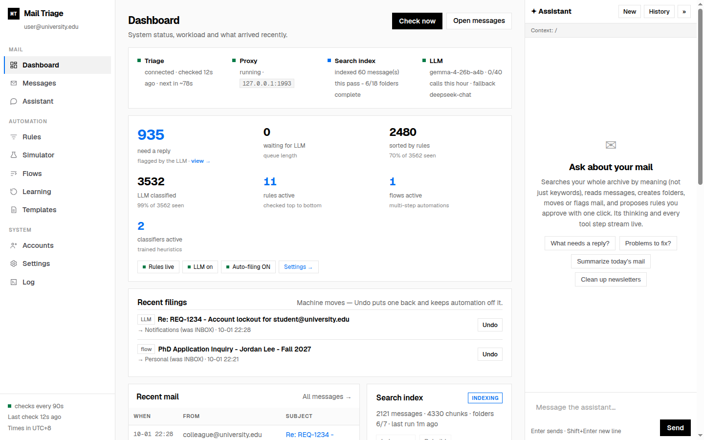
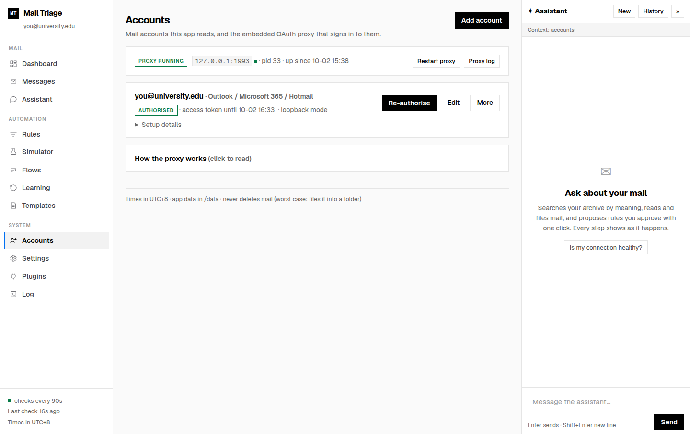
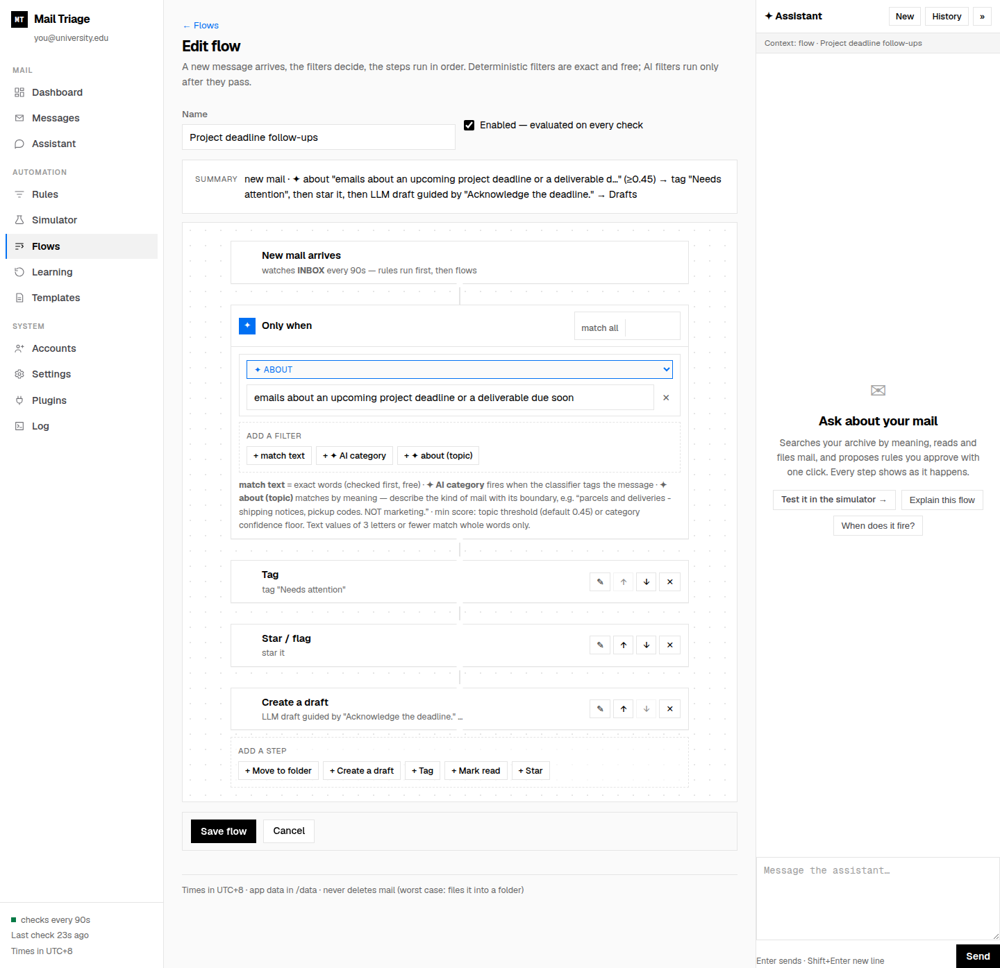
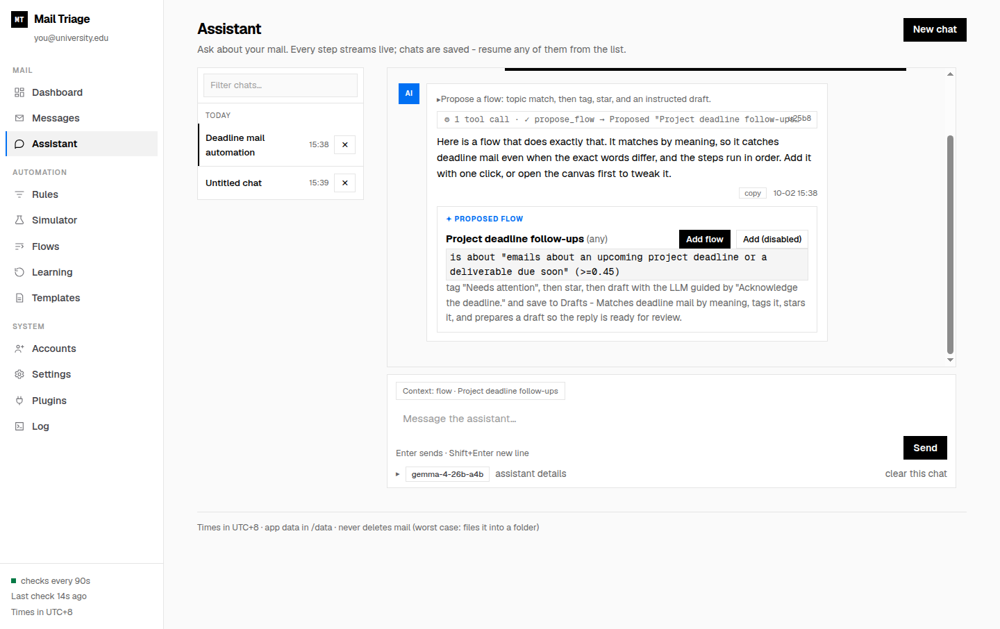

# Mail Triage

**Your mailbox. Your machine. Your rules.**

Mail Triage is a **local-first AI email assistant** combining a tool-calling
agent, hybrid retrieval for RAG, and interpretable ML classifiers. Deterministic
rules handle predictable mail; an LLM handles the rest. Search, organize, draft,
and build automations while keeping your usual email client.

I built it to solve my own cluttered inbox and use it as my daily mail agent.
The project explores a practical applied-AI question: **which tasks need an LLM,
which can be handled by smaller models or rules, and how do you evaluate the
tradeoffs before letting automation act?**



[Quick start](#quick-start) · [Engineering highlights](#engineering-highlights) · [Evaluation](#evaluation-and-model-selection) · [Features](#why-mail-triage) · [Documentation](docs/README.md)

**Release scope:** a single-mailbox, self-hosted application, used daily by its
author. The UI is bound to localhost and has no built-in authentication; use an
authenticated reverse proxy or VPN for remote access. See
[release notes](RELEASE_NOTES.md) for supported scope and known limitations.

## Engineering highlights

| Area | Implementation |
| --- | --- |
| **Agentic workflows** | A streaming tool-calling agent for mailbox operations, automation proposals, and classifier management. Bounded tool rounds and result budgets, per-capability permissions, approval queues, and persisted action logs. |
| **Hybrid retrieval / RAG** | Metadata filtering, SQLite FTS5/BM25 lexical search, `sqlite-vec` vector search, reciprocal rank fusion (RRF), and cross-encoder reranking. Local embeddings and reranking run on CPU through FastEmbed/ONNX. |
| **Applied ML** | Decision-list and Naive Bayes fast paths, plus a learning subsystem with feature-engineered logistic regression, versioned model artifacts, label provenance, calibration metrics, and shadow evaluation before promotion. |
| **LLM evaluation** | Workload-specific model benchmarking with frozen cases, production prompts and tool schemas, deterministic expected answers, severity-weighted scoring, and adversarial probes. |
| **Local deployment** | A Dockerized Python/Flask application with SQLite persistence, a background worker, an embedded OAuth mail proxy, and a separately configured OpenAI-compatible LLM endpoint. |
| **Testing and extensibility** | Mock end-to-end tests across mail, models, retrieval, and plugins; an extension SDK with supervised worker processes, resource limits, and permission-gated host APIs. |

## Evaluation and model selection

Model choice is evaluated against **this application's workload**, rather than
general leaderboard scores alone. The current [model benchmark](benchmarks/README.md)
has **600 frozen cases across six suites**, with scenario-family dev/acceptance
splits. It covers classification, assistant tool use, drafting, rule learning,
simulation, and thought summarization.

- **Test design:** a synthetic mailbox with explicit ground truth, production
  prompts and tool schemas, and deterministic scoring rather than model-generated
  expected answers or an LLM judge.
- **Reliability:** schema validity, prompt-injection compliance, honest no-match
  behavior, and guard-rule semantics. Task quality, failure counts, and a
  severity-weighted cost index are reported separately.
- **Comparison discipline:** incomplete runs are ineligible for ranking;
  paired, family-clustered bootstrap confidence intervals and pre-registered
  noninferiority margins test replacement claims.
- **Deployment tradeoffs:** classification latency, memory footprint, serving
  configuration, and model-specific adaptations alongside task scores.

One useful finding: **strong tool use does not imply reliable classification**.
On the corrected case set, the 4B AgentMercury candidate passed assistant and
rule-learning noninferiority tests, but failed the classification margin. Both it
and the larger baseline followed some label instructions embedded in email.
MiniCPM5-2B passed assistant and drafting noninferiority tests, but did not qualify
as a drop-in replacement either. See the [evaluation summary](docs/model-evaluation.md)
for results, measurement limits, and the historical 196-case study.

Retrieval was evaluated separately: [the RAG study](docs/rag-lite-report.md)
compares lexical, dense, hybrid, and reranked search, including CPU/GPU tradeoffs
and index-coverage effects. These are workload-specific studies, not general model
rankings or guarantees of behavior on other mailboxes.

The [in-app model benchmark](docs/model-bench-plugin.md) provides a separate,
bounded synthetic probe suite for checking a configured endpoint's compatibility,
classification behavior, and latency.

## Why Mail Triage?

### Connect institutional email with built-in OAuth2

Mail Triage bundles [simonrob/email-oauth2-proxy](https://github.com/simonrob/email-oauth2-proxy)
to connect OAuth2-enabled mailboxes, including institutional accounts. Add an
account, authorize it, and check its token status from the **Accounts** page—the
proxy runs inside the app's container, so there is no separate proxy service to
manage.

Your provider's OAuth app registration and access policies still apply. The setup
guide walks through the connection process.



*Connect an OAuth2-enabled institutional mailbox through the built-in email-oauth2-proxy integration.*

### Privacy first, powered by a local agent

Run classification, mailbox chat, and drafting against a **local LLM**. The
database and search index live on your host, and the default semantic search
backend runs locally on CPU. You do not need a cloud AI service to use the app.

You choose the model endpoint. If you configure a hosted model or cloud fallback,
the email content included in those requests goes to that provider. Use local
endpoints to keep AI processing on your own machine.

### Build powerful flows visually

Turn inbox habits into repeatable, multi-step automations with a visual
**trigger → filters → steps** builder. Match exact message fields, an AI-assigned
category, or a topic by meaning, then chain actions in order:

- Move messages into folders.
- Tag, star, or mark them read.
- Create drafts from fixed text, saved templates, or AI instructions.

For example: **when a message is about a project deadline, tag it, star it, and
draft an acknowledgment.** Drafts land in your mailbox's Drafts folder for review.
You can build a flow on the canvas or describe it to the assistant and approve
its proposal with one click.



*Turn inbox habits into multi-step automations using exact filters, AI categories, or topic matching.*

### Go from natural language to action

The assistant is an action interface across the app, with broad coverage of
everyday mailbox and automation tasks. Search and read mail, organize messages,
classify and tag them, draft replies, create folders, propose or update rules and
flows, and train or evaluate classifiers—all through conversation.

Try requests like:

> “Find the email about my tax refund.”
>
> “Move this message to Receipts and mark it read.”
>
> “When mail is about a project deadline, tag it and draft an acknowledgment.”
>
> “Train a classifier from the messages I've tagged.”



*Describe what you want in plain language. Review the assistant's proposed automation and approve it in one click.*

Responses stream live, tool calls and results are visible, and actions are logged.
Per-capability permissions let you choose **Off**, **Ask me**, or **Auto** for
supported actions; rule and flow proposals have one-click approval.

### Extend it with plugins

Add capabilities without changing the core app. Plugins can provide **assistant
tools, classifiers, rule conditions, draft providers, search re-rankers, event
integrations, and scheduled reports**.

Built-in examples include an invoice finder, a daily digest, a commitments and
deadline extractor, a subscription/renewal watcher, an unsubscribe helper that
groups opt-out links by sender, language-aware drafts, and webhook notifications.
Manage each plugin's settings and permissions in the
UI. Plugins run in separate sandboxed worker processes with memory, time, and
host-call limits; access to mail, models, and the network is permission-gated and
audited.

Start with the [plugin authoring guide](docs/plugins-authoring.md) and
[SDK](sdk/README.md) to build your own.

## More than an AI chat window

- **Rules first.** Deterministic filters handle predictable mail before AI is
  called. Guard rules keep important messages in place.
- **Classification with context.** Get a category, confidence, summary, and reason
  for messages that rules do not catch. AI auto-filing starts off.
- **Learning that reduces AI calls.** Train small, auditable classifiers from your
  tags or previous verdicts. Confident matches skip the LLM; learning-loop
  specialists run in shadow mode until you promote them.
- **Search by meaning or exact detail.** Find a topic even when you cannot remember
  the wording, or narrow results by sender, date, and exact terms. The default
  search backend needs no GPU.
- **A practical triage workspace.** Sanitized message viewing, file-and-next,
  snooze, tags, bulk classification, an undo trail, and a responsive mobile UI.

See the [full feature tour](docs/features.md) for details.

## Quick start

You need **Docker and Compose**, a mailbox, and—if you want AI features—an
OpenAI-compatible model endpoint. Rules and local search run on CPU; LLM hardware
requirements depend on the model you choose.

Clone this repository, open its directory, then run:

```bash
cp .env.example .env
# Set LLM_BASE_URL and LLM_MODEL for your local model.
# Leave them blank to start in rules-only mode.
docker compose up -d --build
```

Open **http://localhost:8097**. The **Get started** checklist walks you through:

1. Connecting and authorizing your mailbox.
2. Configuring and testing your model endpoint.
3. Building your search index.

Then create a rule, build a flow, or ask the assistant to help organize your mail.
Without an LLM, rules and search still work; AI classification and drafting wait
until an endpoint is available.

See [Getting started](docs/getting-started.md) for hardware tiers, local model
options, and account setup. See [Deployment](docs/deployment.md) for remote access,
TLS, backups, and upgrades.

## How it works

One container runs the web UI, background worker, and embedded OAuth mail proxy.
The database and search index persist on your host; the model endpoint is configured
separately.

```text
Your email provider
        ↕ OAuth2 / TLS
┌──────────────────────────────────────────────┐
│ Mail Triage container                        │
│                                              │
│ email-oauth2-proxy ↔ worker ↔ web UI :8097     │
└──────────────────────┬───────────────────────┘
                       ├── Local database + search index
                       └── Your LLM endpoint (local recommended)
```

The triage pipeline applies **rules → fast-path classifiers → LLM for the rest**,
then files or suggests according to your settings. Flows add ordered actions when
their conditions match. Each decision keeps an audit trail so you can see what
happened and why.

### Retrieval pipeline

```text
Query → sender/date/exact-term hints → metadata prefilter
      → BM25 + vector candidates → RRF fusion → cross-encoder reranking
      → ranked mail for search and assistant context
```

Email-specific preprocessing strips quoted history where appropriate to reduce
duplicate context. SQLite keeps lexical search, vectors, and message metadata
close together; the default embedding and reranking path needs no GPU or separate
model service. LLM inference has its own hardware requirements.

### Learning lifecycle

The learning subsystem separates **LLM-generated weak labels from explicit human
labels** and records model/feature versions and prediction evidence. Logistic
regression specialists expose per-feature contributions; evaluation includes
precision/recall, average precision, Brier score, and reliability buckets.

Specialists start in **shadow mode** so their predictions can be evaluated before
they influence behavior. This is an implemented first slice, with broader routing
and model kinds tracked separately in the
[learning-loop design](docs/mail-intelligence/design.md) and
[improvement roadmap](docs/mail-intelligence/improvement-roadmap.md).

## Stay in control

- **AI auto-filing is opt-in.** Rules act live by default; use dry-run mode to
  preview automation.
- **Assistant permissions are explicit.** Choose which capabilities may run
  automatically and which need approval. Sending and moving mail to Trash are
  disabled by default.
- **Draft before sending.** Flow-generated replies go to Drafts for review in
  your normal email client.
- **Protect and undo.** Guard rules pin matching mail in place; Undo restores
  filed messages and keeps automation off those messages.
- **Review before promoting.** Learning-loop specialists start in shadow mode
  and only take over when you promote them.
- **Inspect what happened.** Classification reasons, tool results, automation
  events, and plugin activity are visible and logged. LLM calls are capped per hour.

## Operations

Run these commands from the repository root:

```bash
docker compose ps                                      # status
docker logs -f mail-triage                              # live logs
docker compose up -d --build                            # rebuild after code changes
docker restart mail-triage                              # restart
docker exec mail-triage python app.py --check            # read-only health report
docker exec mail-triage python app.py --doctor           # hardware + model setup advice
docker exec mail-triage python app.py --index            # resumable search indexing
docker exec mail-triage python app.py --plugins list     # installed plugins
docker exec mail-triage python learning.py report        # learning loop state
```

Persistent state lives in `data/`: `triage.db` holds app data, and
`data/emailproxy/` holds the generated proxy configuration, encrypted token cache,
and proxy log. Back up this directory; see the
[deployment guide](docs/deployment.md).

## Documentation and development

| Guide | What you'll find |
| --- | --- |
| [Getting started](docs/getting-started.md) | Installation, hardware, models, and first-run setup |
| [Feature tour](docs/features.md) | Detailed coverage of the app's capabilities |
| [Deployment](docs/deployment.md) | Ports, TLS, backups, and upgrades |
| [Plugin authoring](docs/plugins-authoring.md) · [SDK](sdk/README.md) | Write, install, and test extensions |
| [Plugin architecture](docs/plugin-architecture.md) | Extension types, sandboxing, and assistant integration |
| [Model evaluation](docs/model-evaluation.md) · [Benchmark](benchmarks/README.md) | Current 600-case evaluation, comparison snapshots, and historical study |
| [RAG evaluation](docs/rag-lite-report.md) | Retrieval ablations, CPU deployment tradeoffs, and measurement limits |
| [Fusion Lab](docs/fusion-lab.md) | Experimental TinyJev + MiniCPM classification comparison and optional sidecar |
| [Model benchmark plugin](docs/model-bench-plugin.md) | Synthetic endpoint probes, scoring, and resumable benchmark execution |
| [Learning loop](docs/mail-intelligence/design.md) | Model lifecycle, evaluation, and decision provenance |
| [Docs index](docs/README.md) | All guides, design records, and research |
| [Release notes](RELEASE_NOTES.md) · [Release procedure](docs/releasing.md) | Release scope, known limitations, and validation commands |

The core lives in `app.py` (UI), `engine.py` (mail and automation), `store.py`
(SQLite), and `proxy.py` (OAuth proxy management). Search lives in `rag.py` /
`rag_lite.py`; learning in `learning.py` / `heuristics.py`; the plugin system in
`plugins.py`, `plugin_rt.py`, and `plugin_worker.py`.

Create a development environment (Python 3.12, matching the container), then run
the offline suites. No real mailbox or LLM endpoint is required:

```bash
python3.12 -m venv .venv
.venv/bin/python -m pip install -r requirements.txt
```

```bash
.venv/bin/python tests/mock_e2e.py     # app suite: mock IMAP, LLM, and embeddings
.venv/bin/python tests/mock_e2e.py --list   # sections and their domain groups
.venv/bin/python tests/mock_e2e.py --only core,rag   # partial run by domain
.venv/bin/python tests/proxy_e2e.py    # proxy suite: mock OAuth and IMAP
.venv/bin/python benchmarks/v2/tests/run_v2_tests.py  # benchmark integrity + scoring
```

On a dirty working tree the app suite auto-runs only the domains its changed
files touch; a clean tree runs everything. `--all` forces the full suite.

### Project ownership and development approach

I defined the product concept, directed the technical questions, and designed the
experiments. Implementation was carried out through AI-assisted development
workflows. Daily use of the app informs the practical requirements; the linked
design records and evaluation reports document the engineering decisions and
experimental evidence.

## License and acknowledgments

Mail Triage is [MIT licensed](LICENSE).

OAuth2 mailbox connectivity is powered by
[email-oauth2-proxy](https://github.com/simonrob/email-oauth2-proxy) by Simon Robinson.
